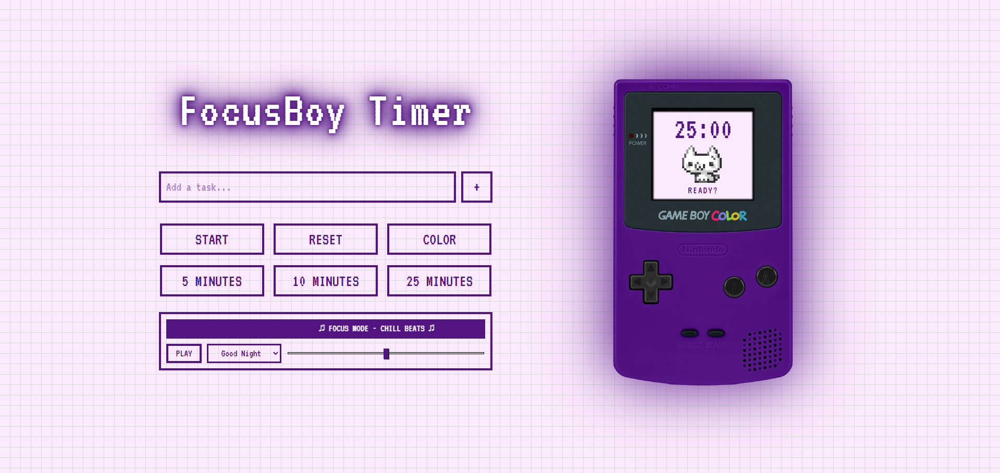

# 🎮 FocusBoy

**Your Retro Productivity Pal**

  

  <a href="#-features">Features</a> •
  <a href="#-technical-highlights">Technical Highlights</a> •
  <a href="#-embed-in-notion">Notion Setup</a>

---

## 👾 About The Project

**FocusBoy** is a nostalgic take on the Pomodoro technique, blending the "Y2K Handheld" aesthetic with professional-grade timekeeping logic.

I built this because most web timers are either boring, glitchy, or just don't fit the vibe. FocusBoy is designed to be **embedded**, **customizable**, and **drift-free**. It's not just a timer; it's a desk companion that makes productivity feel like a game.

## ✨ Key Features

- **⏱️ Drift-Free Precision:** Unlike standard JS timers that lose sync when tabs are inactive, FocusBoy uses `Date.now()` delta-checks to ensure 100% accuracy.
- **🐱 Pixel Pet Companion:** Includes a reactive "Tamagotchi-style" mascot that works when you work, sleeps when you rest, and celebrates when you finish.
- **🎵 Built-in Lo-Fi Player:** Integrated Web Audio API player with volume control for instant focus music.
- **🎨 4 Retro Skins:** Switch instantly between Atomic Purple, Teal, Classic Grey, and Yellow using CSS variables.
- **📱 Responsive Design:** A floating layout optimized for Notion dashboards, OBS overlays, or side-panels.

## 🧠 Technical Highlights

This wasn't just about CSS; the logic needed to be solid for a production-grade tool.

### 1. Solving the "Browser Drift"

Standard `setInterval` loops often drift by a few milliseconds when the browser main thread is busy. To fix this, I implemented a **Delta-Time** approach:

1.  Calculates the exact `Target Time` (Timestamp) immediately upon start.
2.  The loop constantly checks the difference between `Now` and `Target`.
3.  This ensures the timer is accurate to the millisecond, regardless of CPU load.

### 2. State-Driven UI

The application separates **State** (Time, Running Status) from **View** (DOM updates). Changing the skin doesn't just change a color; it updates the CSS Variables scoped to the `<body>`, allowing the entire app (borders, text, SVG shadows) to thematically shift without expensive re-renders.

    /* Example of the Skin System */
    body.skin-1 { --screen-color: #73c700; }
    body.skin-2 { --screen-color: #007198; }

### 3. Audio & Accessibility

- **Web Audio API:** The music player controls volume dynamically without relying on external iframes.
- **Accessibility:** All inputs have ARIA labels, and standard browser sliders are styled with `appearance: none` for cross-browser consistency.

## 🚀 Embed in Notion

FocusBoy is built to live in your workspace.

1.  Copy the live link: `https://bethjaye136.github.io/focusboy-timer/`
2.  Go to your Notion page.
3.  Type `/embed` and paste the link.
4.  Resize the block until the Gameboy fits perfectly!

## 🛠️ Tech Stack

-  **Semantic Structure**
-  **Flexbox & Variables**
-  **ES6+ Logic & Audio API**

---

**Credits:**
Music from #Uppbeat (free for Creators!):
[Skygaze - Glowness](https://uppbeat.io/t/skygaze/glowness)
License code: SWCKLXKQCJFNAQ4U

---

  Built with 💚 by BethJaye

